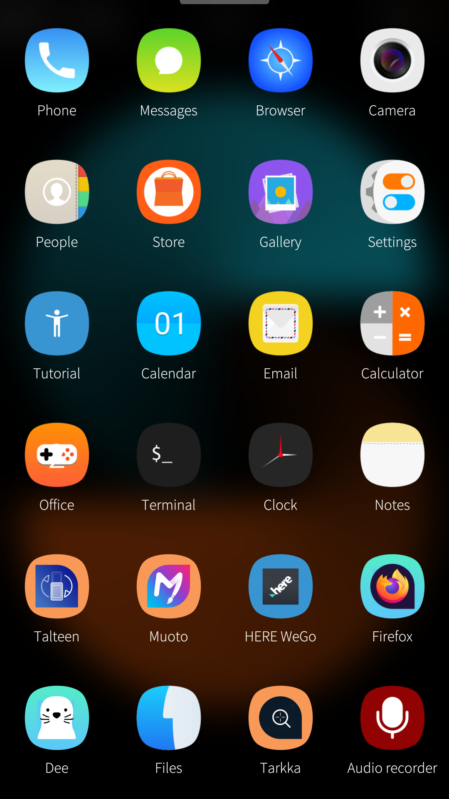

# Xenlism Wildfire for Sailfish OS

Xenlism Wildfire for Sailfish OS.

[](https://github.com/uithemer/harbour-themepack-xenlism-wildfire/blob/main/LICENSE) [](https://github.com/uithemer/harbour-themepack-xenlism-wildfire/issues) [](https://github.com/uithemer/harbour-themepack-xenlism-wildfire/releases/latest) [](https://liberapay.com/fravaccaro)



## Request a new icon

You can request a new icon via the theme companion app or by [opening an issue](https://github.com/uithemer/harbour-themepack-xenlism-wildfire/issues).

## Create custom theme packs

Documentation on how to create theme packs available [here](https://uithemer.github.io/harbour-muoto/).

## Working on the icons

The PNGs under `theme/` are committed and are what ships, so re-export them after
touching any SVG:

```
cd theme && ./themepack-helper.sh
```

Icons exported from SVG converters tend to place gradient coordinates far outside
the document and scale them back with a `gradientTransform`. Cairo-based renderers
clip those shapes, which silently drops whole faces from an icon. Normalise new
artwork before committing it:

```
python3 tools/normalize-gradients.py $(find theme -name '*.svg')
```

CI checks both of these and fails the build if an icon no longer matches its source.

## Translate

Request a new language or contribute to existing languages on the [Transifex project page](https://explore.transifex.com/fravaccaro/xenlism-wildfire/).

## Builds

Builds available [here](https://openrepos.net/content/fravaccaro/xenlism-wildfire-theme-pack).

## Credits

Thanks to [Xenlism](https://github.com/xenlism/wildfire).
